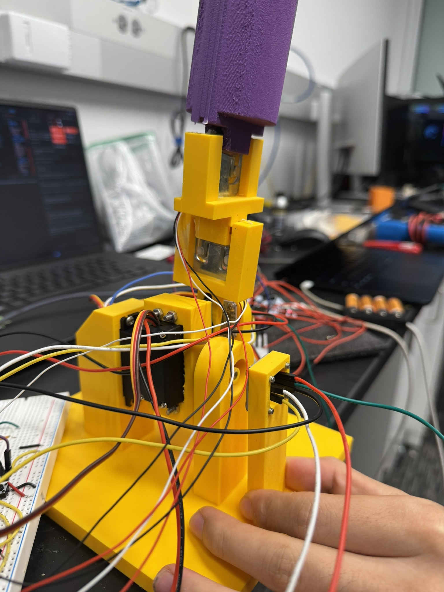
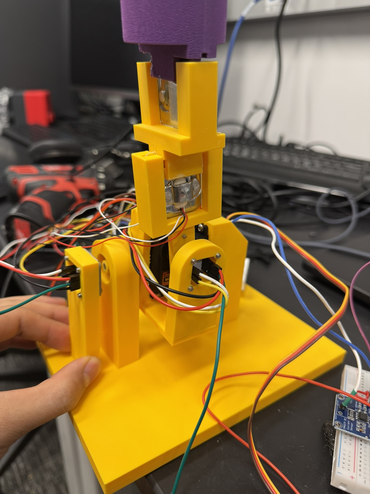

# HW18 Force Feedback Joystick

This folder contains the simple Pico 2 W center-spring firmware for the
two-axis force-feedback joystick.

## Wiring

All grounds are common: Pico GND, motor-driver GND, sensor GND, and motor
supply GND are tied together. The motors are powered from the motor supply
through the H-bridges, not from the Pico 3.3 V pin.

| Cable / Signal | Pico Connection | Connected Device |
|---|---|---|
| X encoder SDA | GP4, physical pin 6 | X AS5600 SDA |
| X encoder SCL | GP5, physical pin 7 | X AS5600 SCL |
| Y encoder SDA | GP6, physical pin 9 | Y AS5600 SDA |
| Y encoder SCL | GP7, physical pin 10 | Y AS5600 SCL |
| X motor input A | GP10, physical pin 14 | X H-bridge IN1 |
| X motor input B | GP11, physical pin 15 | X H-bridge IN2 |
| Y motor input A | GP12, physical pin 16 | Y H-bridge IN1 |
| Y motor input B | GP13, physical pin 17 | Y H-bridge IN2 |
| H-bridge enable/sleep | Pico 3V3 | Driver EN / SLEEP pulled high |
| Encoder power | Pico 3V3 and GND | AS5600 VCC and GND |
| Motor power | External motor supply | H-bridge VM / motor power input |

## Figures

## Operation

Hold the joystick at center when the Pico starts. The firmware samples the two
AS5600 encoders, saves that position as zero, and then automatically starts a
simple encoder-feedback spring back to center.
